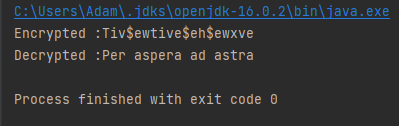
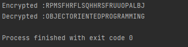
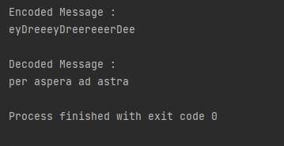

#Laboratory work nr. 1

<br/>
<br/>
<br/>

---

<br/>

### Course: Cryptography & Security
### Author: Berestean Stefan

---

<br/>

### Caesar Cipher with substitution

<br/>

#### History:

In cryptography, a Caesar cipher, 
also known as a Caesar's cipher, the shift cipher, Caesar's Code or 
Caesar Shift, is one of the simplest and most widely-known encryption 
techniques. It is a type of substitution cipher in which each letter in 
the plaintext is replaced by a letter some fixed number of positions further
down the alphabet. For example, with a shift of 3, A would be replaced by D,
B would become E, and so on. The method is named after Julius Caesar, who used it 
to communicate with his generals.

<br/>

####Theory:

Caesar Cipher it is a substitution cipher in which each letter in the plaintext 
is replaced by a letter some fixed number of positions down the alphabet.
For example, with a left shift of 3, D would be replaced by A, E would 
become B, and so on. 

<br/>

####Objectives

* To understand basic concepts of cryptography
* To implement Caesar cipher
* To understand how substitution work
* Create encryption method and decryption

---

####Implementation description

1.) Create a constructor to initialize data

```
public Caesar_Cipher(String message, int key) {
this.message = message;
this.key = key;
}
```

<br/>

2.) In encryption, traverse each char of message


```
for (char ch: message.toCharArray()) {
encryptedMessage += shiftChar(ch, key);
}
return encryptedMessage;
```

<br/>

3.) Create shiftCharMethod, which basically ensures
if index is greater than length of alphabet length, then
puts index back.

```
private char shiftChar(char ch, int key) {
        var modulo = key % ALPHABET_LENGTH;
        return (char) (ch + modulo);
    }
```

<br/>

4.) In decryption,we do the same like in encryption, just
 subtracting value of the key back.

```
for (char ch: encrypted_message.toCharArray()) {
            decryptedMessage += shiftChar(ch, -key);
        }
        return decryptedMessage;
```

<br/>

####Conclusion

In this laboratory work, we got familiarized with cryptography,
how to encrypt and decrypt message, and the main principle is
to shift chars given by the key that user gives.

<br />

####Screenshot



<br/>

---

###Caesar with substitution and permutation

<br/>

####History 

Actually I couldn't find information about history of this cipher
but I supose that it was an improvement of the original method.

<br/>

####Objectives

* To create a Caesar Cipher
* To understand how permutation works

---

####Implementation description

1.) Create a constructor to initialize data

```
 public Caesar_With_Permutation_Cipher(String message, int key, String keyword) {
 this.message = message;
 this.key = key;
 this.keyword = keyword;
}
```
<br/>

2.)Create the <b>removeDuplicates</b> method, because here at the beggining
of the alphabet we need to put our keyword.Create an arraylist and check 
if the element is not in the list,we add it.

```
private List<Character> removeDuplicates() {
        var keywordArray = this.keyword.toCharArray();
        List<Character> list = new ArrayList<>();

        for (char ch: keywordArray) {
            if(!list.contains(ch))
                list.add(ch);
        }
        return list;
    }
```

<br/>

3.) Create <b>generateAlphabet</b> method, which will generate new alphabet
based on removeDuplicates method created earlier. Actually we add list from 
removeDuplicates and check from original alphabet if the element is already
in list then pass, else add to list.

```
private List<Character> generateAlphabet() {
        var key = removeDuplicates();
        char[] alphabet = ALPHABET.toCharArray();
        List<Character> finalAlphabet = new ArrayList<>();

        finalAlphabet.addAll(key);

        for (char ch : alphabet)
            if (!key.contains(ch))
                finalAlphabet.add(ch);

        return finalAlphabet;
    }
```

<br/>

4.) Create a <b>restoreOriginalIndexes</b> method which
will check if index passed length of alphabet, it will 
back to alphabet range.

```
private List<Integer> restoreOriginalIndexes(String encryptedMessage) {
        List<Integer> originalMessageIndexes = new ArrayList<>();
        var alphabetChanged = generateAlphabet();

        for (char ch: encryptedMessage.toCharArray()) {
            int index = (alphabetChanged.indexOf(ch) - this.key) ;
            index = index >= 0 ? index % ALPHABET_LENGTH : index + ALPHABET_LENGTH;
            originalMessageIndexes.add(index);
        }
        return originalMessageIndexes;
    }

```

<br/>

5.) Encrypt and decrypt method are the same like previous caesar
cipher.

<br/>

####Conclusion

In this laboratory work, we got familiarized permutation,
how to align keyword at the beggining of alphabet,
to shift chars given by the key that user gives.

<br />

####Screenshot


---


### Vigenere Ciphere

<br/>

#### History:

The very first well-documented description 
of a polyalphabetic cipher was by Leon Battista
Alberti around 1467 and used a metal cipher disk to switch 
between cipher alphabets. Alberti's system only switched 
alphabets after several words, and switches were indicated
by writing the letter of the corresponding alphabet in the 
ciphertext. Later, Johannes Trithemius, in his work 
Polygraphiae (which was completed in manuscript form in 
1508 but first published in 1518),invented the tabula 
recta, a critical component of the Vigenère cipher.

<br/>

####Theory:

Each row starts with a key letter. The rest of the 
row holds the letters A to Z (in shifted order). 
Although there are 26 key rows shown, a code will 
use only as many keys (different alphabets) as there
are unique letters in the key string, here just 5 
keys: {L, E, M, O, N}. For successive letters of 
the message, successive letters of the key string
will be taken and each message letter enciphered by
using its corresponding key row. The next letter of 
the key is chosen, and that row is gone along to find
the column heading that matches the message character.
The letter at the intersection of is the enciphered letter

<br/>

####Objectives

* To implement Vigenere Cipher
* To understand concepts of crypting Viginere


####Implementation description

1.) Create a constructor to initialize data

```
public Vigenere_Cipher(String message, String key) {
        this.message = message;
        this.key = key;
    }
```

<br/>

2.) Create a <b>generateKey</b> method which will make 
the length of key the same as length of message. While length is not the same,
we add char one by one, and if key is finished, put index = 0 , and repeat the procedure.

```
private String generateKey(String key, int length) {
        String finalKey = "";

        int i = 0;
        while(finalKey.length() != length) {
            if(i == key.length())
                i = 0;
            else{
                finalKey += key.charAt(i);
                i++;
            }
        }
        return finalKey;
    }
```

3.) In encrypt method, make a for loop to go through whole message, and check if char is 
between first letter of alphabet and last ,go further.After that add the corresponding char at index.
And check if j is between key length, if not set back.

```
private String encrypt(String message, String keyword) {
        String encrypted = "";

        for (int i = 0, j = 0; i < message.length(); i++) {
            char ch = message.charAt(i);

            if(ch < 'A' || ch > 'Z')
                continue;
            encrypted += (char) ((ch + keyword.charAt(j) - 2 * 'A') % ALPHABET_LENGTH + 'A');
            j = ++j % keyword.length();
        }
        return encrypted;
    }
```
<br/>

4.) Decryption is the same like encryption, except that here when traverse encrypted
message, we subtract the given char and ensure that is in range of alphabet (%26). After that
add 'A' to transform into char back.

```
private String decrypt(String encryptedMessage, String keyword) {
        String decryptedMessage = "";

        for (int i = 0, j = 0; i < encryptedMessage.length(); i++) {
            char ch = encryptedMessage.charAt(i);

            if(ch < 'A' || ch > 'Z')
                continue;

            decryptedMessage += (char) ((ch- keyword.charAt(j) + ALPHABET_LENGTH) % ALPHABET_LENGTH + 'A');
            j = ++j % keyword.length();
        }
        return decryptedMessage;
    }
```

####Conclusion

In this laboratory work, we got familiarized with Veginere cipher, how 
to make the same length key as message, how to perform computations.

<br />

####Screenshot



---
### Playfair cipher

<br/>

#### History:

The Playfair cipher was the first practical digraph substitution
cipher. The scheme was invented in 1854 by Charles Wheatstone
but was named after Lord Playfair who promoted the use of the cipher. 
In playfair cipher unlike traditional cipher we encrypt a pair of alphabets
(digraphs) instead of a single alphabet.
It was used for tactical purposes by British forces in the Second Boer
War and in World War I and for the same purpose by the Australians during World
War II. This was because Playfair is reasonably fast to use and requires
no special equipment.

<br/>

####Theory:

Playfair cipher operates exactly like typical encryption. 
The only difference is that it encrypts a digraph, or a pair of two letters, 
as opposed to a single letter.
An initial 5×5 matrix key table is created. The plaintext encryption 
key is made out of the matrix’s alphabetic characters. Be mindful that you 
shouldn’t repeat the letters. There are 26 alphabets, however, there are 
only 25 spaces in which we can place a letter. The matrix will delete the
extra letter because there is an excess of one letter (typically J).
Despite this, J is there in the plaintext before being changed to I.

<br/>

####Objectives

* To understand basic concepts of Playfair Cipher
* To implement Playfair cipher
* Create encryption method and decryption

---

####Implementation description

1.) Generate the key Square 5 x 5.
The key square is a 5×5 grid of alphabets that acts as the key 
for encrypting the plaintext. Each of the 25 alphabets 
must be unique and one letter of the alphabet is omitted from the table.

```
private String[][] cipherTable(String key) {
        String[][] playfairTable = new String[5][5];
        String keystring = key + "ABCDEFGHIKLMNOPQRSTUVWXYZ";

        for (int i = 0; i < 5; i++)
            for (int j = 0; j < 5; j++)
                playfairTable[i][j] = "";

        for (int k = 0; k < keystring.length(); k++) {
            boolean repeat = false;
            boolean used = false;

            for (int i = 0; i < 5; i++) {
                for (int j = 0; j < 5; j++) {
                    if(playfairTable[i][j].equals("" + keystring.charAt(k)))
                        repeat = true;
                    else if (playfairTable[i][j].equals("") && !repeat && !used) {
                        playfairTable[i][j] = "" + keystring.charAt(k);
                        used = true;
                    }
                }
            }
        }
        return playfairTable;
    }

```

<br/>

2.) The plaintext is split into pairs of two 
letters (digraphs). If there is an odd number of letters, 
a Z is added to the last letter.


```
private String encrypt(String in) {
        length = (int) in.length() / 2 + in.length() % 2;

        for (int i = 0; i < (length - 1); i++) {
            if(in.charAt(2 * i) == in.charAt(2 * i + 1)) {
                in = new StringBuffer(in).insert(2 * i + 1, 'X').toString();
                length = (int) in.length() / 2 + in.length() % 2;
            }
        }

        String [] digraph = new String[length];
        for (int i = 0; i < length; i++) {
            if(i == (length - 1) && in.length() / 2 == (length - 1))
                in = in + "X";
            digraph[i] = in.charAt(2 * i) + "" + in.charAt(2 * i + 1);
        }

        String out = "";
        String [] encDigraphs = new String[length];
        encDigraphs = encodeDigraph(digraph);
        for (int i = 0; i < length; i++)
            out = out + encDigraphs[i];
        return out;
    }
```

<br/>

3.) If both the letters are in the same column: 
Take the letter below each one 
(going back to the top if at the bottom).
If both the letters are in the same row: 
Take the letter to the right of each one.
If neither of the above rules is true: Form a 
rectangle with the two letters and take the letters on 
the horizontal opposite corner of the rectangle.


<br/>

4.) In decryption,If both the letters are in the same column: 
Take the letter above each one.If both the letters are in the same row: 
Take the letter to the left of each one.
If neither of the above rules is true: Form a rectangle
with the two letters and take the letters
on the horizontal opposite corner of the rectangle.

```
public String decrypt(String out) {
        String decoded = "";
        for (int i = 0; i < out.length() / 2; i++) {
            char a = out.charAt(2 * i);
            char b = out.charAt(2 * i + 1);
            int r1 = (int) getPoint(a).getX();
            int r2 = (int) getPoint(b).getX();
            int c1 = (int) getPoint(a).getY();
            int c2 = (int) getPoint(b).getY();

            if(r1 == r2) {
                c1 = (c1 + 4) % 5;
                c2 = (c2 + 4) % 5;
            }
            else if(c1 == c2) {
                r1 = (r1 + 4) % 5;
                r2 = (r2 + 4) % 5;
            }
            else {
                int temp = c1;
                c1 = c2;
                c2 = temp;
            }
            decoded = decoded + table[r1][c1] + table[r2][c2];
        }
        return decoded;
    }
```

<br/>

####Conclusion

In this laboratory work, we got familiarized with cryptography,
how to encrypt and decrypt message, and how to implement Playfair Cipher.

<br />

####Screenshot



<br/>

---

