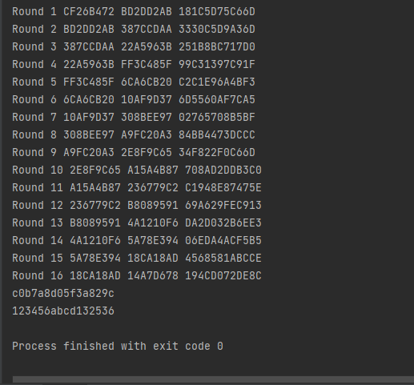
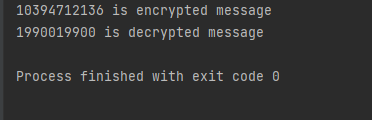

#Laboratory work nr. 2

<br/>
<br/>
<br/>

---

<br/>

### Course: Cryptography & Security
### Author: Berestean Stefan

---

<br/>

## Theory:
Symmetric cryptography, known also as secret key cryptography, 
is the use of a single shared secret to share encrypted data 
between parties. Ciphers in this category are called symmetric 
because you use the same key to encrypt and to decrypt the 
data. In simple terms, the sender encrypts data using a 
password, and the recipient must know that password to access
the data.Symmetric encryption is a two-way process. 
<br/>
With a block of plaintext and a given key, symmetric ciphers will always 
produce the same ciphertext. Likewise, using that same key on
that block of ciphertext will always produce the original 
plaintext. Symmetric encryption is useful for protecting data 
between parties with an established shared key and is also 
frequently used to store confidential data.
<br/>
A stream cipher is a method of encrypting text (to produce ciphertext) 
in which a cryptographic key and algorithm are applied to each 
binary digit in a data stream, one bit at a time. The main 
alternative method to stream cipher is, in fact, the block 
cipher, where a key and algorithm are applied to blocks of data
rather than individual bits in a stream.


## Objectives:
1. Get familiar with the symmetric cryptography, stream and block ciphers.

2. Implement an example of a stream cipher.

3. Implement an example of a block cipher.

4. The implementation should, ideally follow the abstraction/contract/interface used in the previous laboratory work.

5. Please use packages/directories to logically split the files that you will have.

6. As in the previous task, please use a client class or test classes to showcase the execution of your programs.

---
<br/>

### Block Cipher (DES)

#### Implementation:

* In the first step, the 64-bit plain text block is handed over to an initial Permutation (IP) function.

```
  String permutation(int[] sequence, String input)
  {
  String output = "";
  input = hextoBin(input);
  for (int i = 0; i < sequence.length; i++)
  output += input.charAt(sequence[i] - 1);
  output = binToHex(output);
  return output;
  }    

```
* The initial permutation is performed on plain text.
```
plainText = tools.permutation(IP, plainText);
```
* Next, the initial permutation (IP) produces two halves of the permuted block; saying Left Plain Text (LPT) and Right Plain Text (RPT).
```
"After splitting: L0="
                        + plainText.substring(0, 8).toUpperCase()
                        + " R0="
                        + plainText.substring(8, 16).toUpperCase()
                        + "\n");
```
* Now each LPT and RPT go through 16 rounds of the encryption process.
```
for (i = 0; i < 16; i++) {
            plainText = tools.round(plainText, keys[i], i);
        }
```
* In the end, LPT and RPT are rejoined and a Final Permutation (FP) is performed on the combined block
```
plainText = plainText.substring(8, 16)
                + plainText.substring(0, 8);

        // final permutation
        plainText = tools.permutation(IP1, plainText);
```
* The result of this process produces 64-bit ciphertext.
```
public String encrypt(String plainText, String key) {
        int i;
        // get round keys
        String keys[] = tools.getKeys(key);

        plainText = tools.permutation(IP, plainText);
        System.out.println("After initial permutation: "
                + plainText.toUpperCase());
        System.out.println(
                "After splitting: L0="
                        + plainText.substring(0, 8).toUpperCase()
                        + " R0="
                        + plainText.substring(8, 16).toUpperCase()
                        + "\n");

        // 16 rounds
        for (i = 0; i < 16; i++) {
            plainText = tools.round(plainText, keys[i], i);
        }

        // 32-bit swap
        plainText = plainText.substring(8, 16)
                + plainText.substring(0, 8);

        // final permutation
        plainText = tools.permutation(IP1, plainText);
        return plainText;
    }

```

<br/>

###Screenshot


<br/>

---

### Stream Cipher (RC4)

#### Implementation:

* The entries of S are set equal to the values from 0 to 255 in ascending order, a temporary vector T, is created.

```
private void fillSTArrays(int length) {
        S.clear();T.clear();

        for (int i = 0; i < length; i++) {
            S.add(i);
            int keyIndex = i % key.length();
            int keyNumber = key.charAt(keyIndex) - '0';
            T.add(keyNumber);
        }
    }
```

* For each S of i algorithm swap it with another byte in S according to a scheme dictated by T[i], but S will still contain values from 0 to 255 :


```
private void swapSTArrays() {
        int j = 0;
        for (int i = 0; i < S.size(); i++) {
            j = (S.get(i) + T.get(i)) % S.size();

            //swap s[i] , s[j]
            int temp = S.get(i);
            S.set(i, S.get(j));
            S.set(j, temp);
        }

    }
```

* Apply encryption
```
 public String encrypt(String message) {

        fillSTArrays(message.length());
        swapSTArrays();

        generatedKey = generateNewKey();

        long encryptedMessage = Long.parseLong(message) ^ generatedKey;

        return encryptedMessage + "";
    }
```

* Implement decryption

```
public String decrypt(String encryptedMessage) {

        long message = Long.parseLong(encryptedMessage) ^ generatedKey;
        return message + "";
    }
```

<br/>

### Screenshot




## Conclusion

In this laboratory work we learned what is a symmetric cypher,
a stream and block cypher.
Learned how to implement them in code, work with interfaces and refactor
our code.